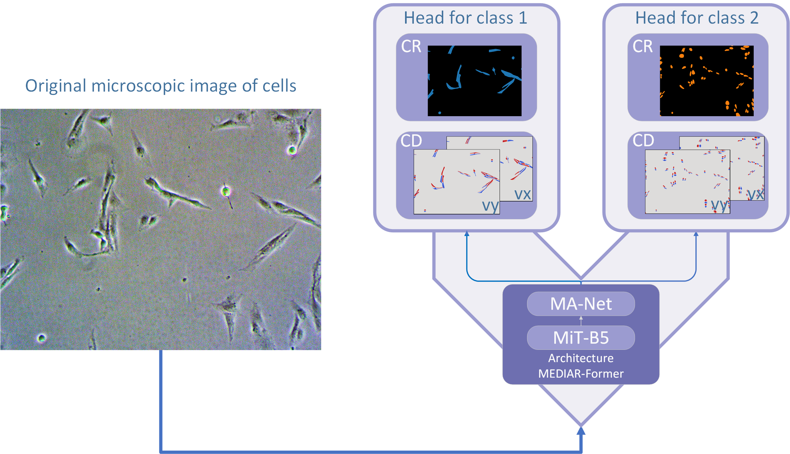

# Mediar-V

---

## Overview

Mediar-V is a multi-head extension of [MEDIAR-Former](https://github.com/Lee-Gihun/MEDIAR) for instance segmentation of overlapping cell structures in microscopy images (e.g., cytoplasm and nucleus of the same cell). Classical flow-field based methods typically support only a single object class and therefore require a separate model for each class. Mediar-V keeps a single backbone and flow representation, but adds dedicated segmentation heads for every target class and trains them jointly, which yields richer supervision and feature sharing between object types. On phase-contrast Glioma C6 and histological CytoNuke datasets with multiple cell classes, this unified architecture outperforms a set of separate single-class models by ≈3 p.p. F1 and ≈4 p.p. AP on average, while using a shared post-processing pipeline that reduces memory usage and FLOPs.



This repository provides two main scripts to configure and run a cell segmentation workflow:

* **generate_config.py**: Interactive script to create JSON configuration files for training or prediction.
* **main.py**: Entry point to train, test, or predict using the generated configuration.

---


## Installation

0. **Install uv**:
Follow the official guide at [https://docs.astral.sh/uv/](https://docs.astral.sh/uv/)

    **Linux / macOS**

    ```bash
    curl -LsSf https://astral.sh/uv/install.sh | sh
    ```

    **Windows**

    ```powershell
    powershell -ExecutionPolicy ByPass -c "irm https://astral.sh/uv/install.ps1 | iex"
    ```

    ```bash
    uv --version
    ```

1. **Clone the repository**:

   ```bash
   git clone https://github.com/Laynholt/Model-V.git
   cd Model-V
   ```
2. **Install dependencies**:

   ```bash
   uv sync
   ```

---

## Dataset Structure

Your data directory must follow this hierarchy:

```
path_to_data_folder/
├── images/        # Input images (any supported format)
│   ├── img1.tif
│   ├── img2.png
│   └── …
└── masks/         # Ground-truth instance masks (any supported format)
    ├── mask1.tif
    ├── mask2.jpg
    └── …
```

If your dataset contains multiple classes, the recommended setup for multi-class segmentation is to store one mask per image as a single array. Masks can be provided either as (H, W) (single-channel) or (H, W, C) (multi-channel, channel-last). Internally, masks are normalized to channel-last format, so (H, W) is automatically converted to (H, W, 1).

Organizing masks into subdirectories is not meant to store “one class per folder” for multi-class segmentation. Instead, it is an optional way to keep alternative mask variants (e.g., different class sets, different numbers of classes, or different class groupings) without duplicating the images/ folder. In that case, each subdirectory contains complete masks (typically multi-channel) for the corresponding variant. The nesting depth under masks/ can be arbitrary (e.g., masks/exp1/variant_A_B/), as long as masks_subdir points to the chosen relative subpath.

```
path_to_data_folder/
├── images/                     # Input images (any supported format)
│   └── img1.bmp
└── masks/
    ├── exp1/
    │   ├── variant_A_B/        # Variant: classes A and B encoded in a single mask per image
    │   │   ├── img1_mask.png
    │   │   └── …
    │   └── variant_A_only/     # Variant: different class set / grouping (e.g., only class A)
    │       ├── img1_mask.png
    │       └── …
    └── exp2/
        └── variant_A_B_v2/     # Another variant (e.g., different labeling scheme)
            ├── img1_mask.png
            └── …
```

In this case, set the masks_subdir field in your dataset configuration to the desired relative path under masks/ (e.g., "exp1/variant_A_B" or "exp2/variant_A_B_v2").

•	**Supported file formats**: tif, tiff, png, jpg, bmp, jpeg.
•	**Mask format**: Masks are expected in channel-last ordering, i.e., (H, W, C) after normalization.
---

## generate\_config.py

This script guides you through creating a JSON configuration for either training or prediction.

### Usage

```bash
python generate_config.py
```

1. **Training mode?** Select `y` or `n`.
2. **Model selection**: Choose from available models in the registry.
3. **(If training)**

   * Criterion selection
   * Optimizer selection
   * Scheduler selection
4. Configuration is saved under `config/templates/train/` or `config/templates/predict/` with a unique filename.

Generated config includes sections:

* `model`: Model component and parameters
* `dataset_config`: Paths, training flag, and mask subdirectory (if any)
* `wandb_config`: Weights & Biases integration settings
* *(If training)* `criterion`, `optimizer`, `scheduler`

---

## main.py

Entrypoint to run training, testing, or prediction using a config file.

### Command-line Arguments

```bash
python main.py [-c CONFIG] [-m {train,test,predict}] [--no-save-masks] [--only-masks]
```

* `-c, --config` : Path to JSON config file (default: `config/templates/train/...json`).
* `-m, --mode`   : `train`, `test`, or `predict` (default: `train`).
* `--no-save-masks` : Disable saving predicted masks.
* `--only-masks`    : Save only raw predicted masks (no visual overlays). This flag depends on `--no-save-masks`.

### Workflow

1. **Load config** and verify mode consistency.
2. **Initialize** Weights & Biases if enabled.
3. **Create** `CellSegmentator` and dataloaders with appropriate transforms.
4. **Print** dataset info for the first batch.
5. **Run** training or inference (`.run()`).
6. **Save** model checkpoint and upload to W\&B if in training mode.

---

## Configurable Parameters

A brief overview of the key parameters you can adjust in your JSON config:

### Common Settings (`common`)

* `seed` (int): Random seed for data splitting and reproducibility (default: `0`).
* `device` (str): Compute device to use, e.g., `'cuda:0'` or `'cpu'` (default: `'cuda:0'`).
* `use_amp` (bool): Enable Automatic Mixed Precision for faster training (default: `false`).
* `roi_size` (int): Defines the size of the square Region of Interest (ROI) used for cropping during training. This same size is also applied for the sliding window inference during validation and testing (default: `512`).
* `iou_threshold` (float): Intersection over Union threshold used for metric computation. All detection and segmentation metrics are calculated based on this IoU value (default: `0.5`).
* `remove_boundary_objects` (bool): Flag to remove boundary objects when testing (default: `True`).
* `masks_subdir` (str): Name of subdirectory under `masks/` containing the instance masks (default: `""`).
* `predictions_dir` (str): Output directory for saving predicted masks (default: `"."`).
* `pretrained_weights` (str): Path to pretrained model weights (default: `""`).

### Gradient Flow Settings (`gradient_flow`)

* `prob_threshold` (float): Probability threshold for binarizing model outputs into masks. Pixels with probability values above this threshold are considered part of an object (default: `0.5`).
* `flow_threshold` (float): Threshold for filtering unreliable flow vectors during instance mask reconstruction. Lower values allow more relaxed flow matching (default: `0.4`).
* `num_iters` (int): Number of iterations used when following the flow field to reconstruct object instances (default: `200`).
* `min_object_size` (int): Minimum area (in pixels) to keep an instance. Smaller regions are discarded as noise (default: `15`).

### Training Settings (`training`)

* `is_split` (bool): Whether your data is already split (`true`) or needs splitting (`false`, default).
* `split` / `pre_split`: Directories for data when pre-split or unsplit.
* `train_size`, `valid_size`, `test_size` (int/float): Size or ratio of your splits (e.g., `0.7`, `0.1`, `0.2`).
* `train_offset`, `valid_offset`, `test_offset` (int/float): The offset by which to take samples. When the data is not split, the samples are formed in the following order: `train`, `valid`, `test` (default: `0`, `0`, `0`).
* `shuffle` (bool): Flag for shuffling data when creating samples (default: `false`).
* `batch_size` (int): Number of samples per training batch (default: `1`).
* `num_epochs` (int): Total training epochs (default: `100`).
* `val_freq` (int): Frequency (in epochs) to run validation (default: `1`).

### Testing Settings (`testing`)

* `test_dir` (str): Directory containing test data (default: `"."`).
* `test_size` (int/float): Portion or count of data for testing (default: `1.0`).
* `test_offset` (int/float): The amount of data by which the sample will be shifted before forming (default: `0`).
* `shuffle` (bool): Shuffle test data before evaluation (default: `true`).

> **Batch size note:** Validation, testing, and prediction runs always use a batch size of `1`, regardless of the `batch_size` setting in the training configuration.

---

## Examples

**Example configuration files for training and testing are available in
`config/templates/train/examples` and `config/templates/predict/examples`.**

### Generate a training config

```bash
python generate_config.py
# Follow prompts to select model, criterion, optimizer, scheduler
# Output saved to config/templates/train/YourConfig.json
```

### Train a model

```bash
python main.py -c config/templates/train/YourConfig.json -m train
```

> After training, the model will automatically attempt to perform testing if the directory for the test data was specified in the configuration file.

### Test a model

```bash
python main.py -c config/templates/predict/YourConfig.json -m test
```

### Predict on new data

```bash
python main.py -c config/templates/predict/YourConfig.json -m predict
```

> Unlike prediction testing, it is not necessary that the specified test directory contains a folder with true masks.

### Run multiple configs from Python

You are not limited to CLI arguments: if you have many configs, you can specify them directly in `main.py` (or another script) and call `main()` in manual mode:

```python
from main import main

for cfg in [
    "config/templates/train/YourConfigA.json",
    "config/templates/train/YourConfigB.json",
]:
    main(manual=True, config_path=cfg, mode="train")
```

---

## Acknowledgments

This project was developed building upon the following open-source repositories:

* [Cellpose](https://github.com/MouseLand/cellpose) by the MouseLand Lab.
* [MEDIAR](https://github.com/Lee-Gihun/MEDIAR) by Lee Gihun.
